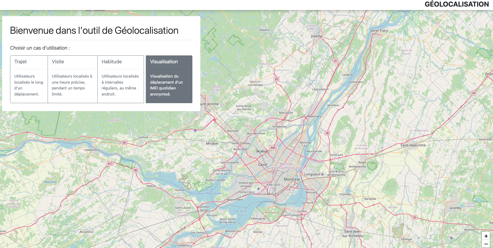
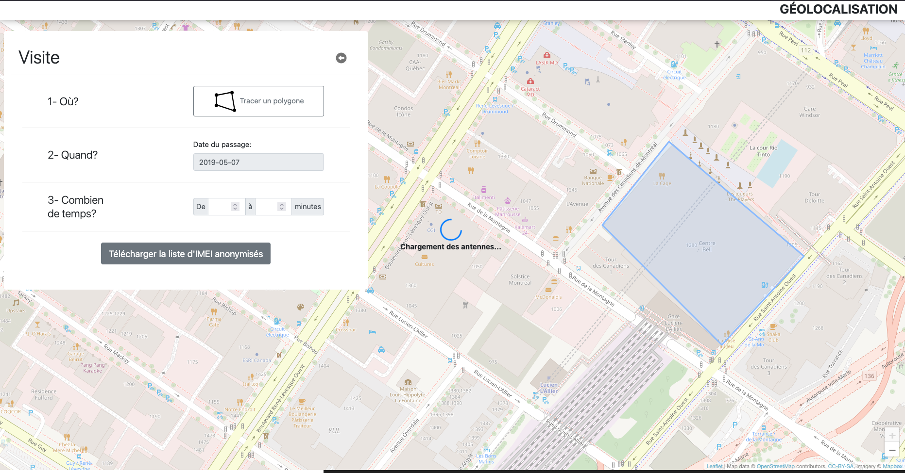

# Géolocalisation

Interactive web application for visualizing mobile device location data with real-time animations and geographic insights. Developped as part of an internship at Vidéotron in Summer 2019.

## Overview

Built with vanilla JavaScript, this application provides an intuitive interface for exploring mobile device movement patterns across geographic regions. The visualization combines interactive maps with custom animations to present location data in an accessible format.

## Tech Stack

- Vanilla JavaScript
- Leaflet.js / Maps API
- Custom CSS animations

## Features

- Interactive map-based visualization of location data
- Real-time data parsing and processing
- Custom animations for geographic transitions
- Responsive design for various screen sizes

## Screenshots

### Main Interface


### Sub-menu example


## Note

This application is no longer functional as it requires access to proprietary Vidéotron telecommunications data that is not publicly available. The screenshots above demonstrate the interface and visualization capabilities when the application was operational.

## Project Structure

```
├── geolocalisation.html    # Main application file
├── mymap.js                # Map initialization and controls
├── animations.js           # Custom animation logic
├── sitestyle.css           # Application styling
├── totalCoverage.json      # Sample data structure
└── Dependencies/           # External libraries
```
